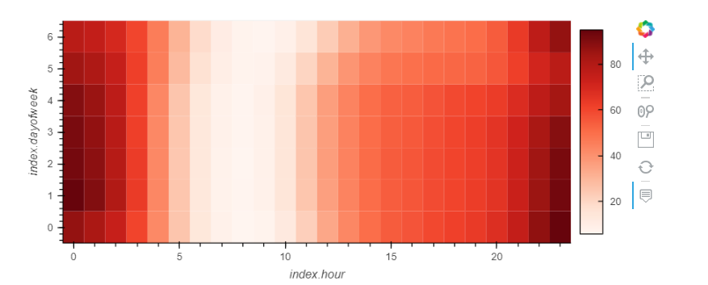
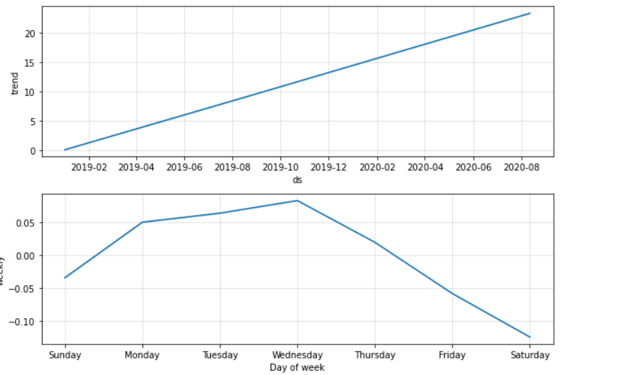

# Mercado-Libre-Revenue-Scenarios
UW Fintech Bootcamp Module 11 Challenge

---

## Technologies

The following libraries are used in this analysis:  
  
  * pystan  
  * prophet
  * hvplot  
  * holoviews
  * io
  * numpy
  * pandas
  
---

## Purpose of Program

The main purpose of this project is to gain experience with facebook Prophet, as well as google colaboratory.  In my opinion both are quite inconsistent and I do not suggest using them in future classes.  Overall we have been tasked with analyzing historical data for Mercado Libre, and using Prophet to create forecasts going forward.  
  
---

## Conclusions

Through this exercise, I have discovered that the majority of the search traffic takes place in the late hours of the day (between 11PM and 1AM): 
 
 
 
 
Additionally we have discovered that the busiest day from a sales stanpoint is Wednesday:
  
  
  
Overall I can certainly see the value of developing these types of forecasts, but the structure used this time around was quite frustrating to work with.  

---

## Contributors

The majority of this project has been done independently, with support from my tutor, Katy Kirby, and my teaching assitant Kyle Gee

---

## License

Program is free to use without license.  Only request is that you notify author of use and application.
  
To discuss usage or general inquires please contact the author at jonm5214@gmail.com
